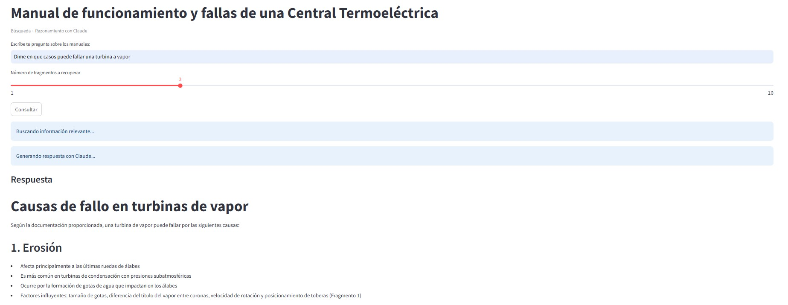
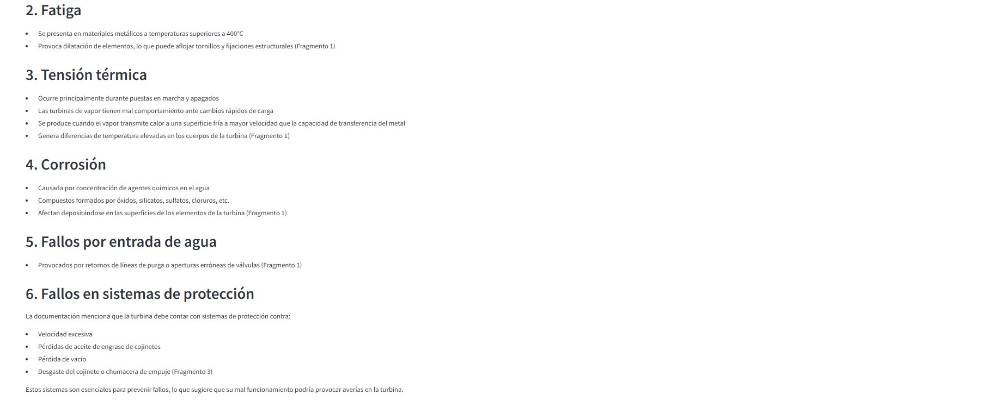
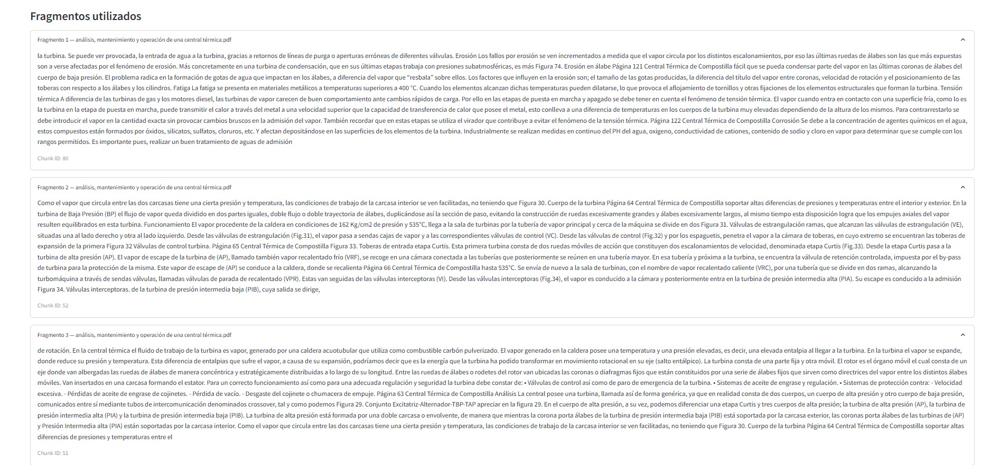

# RAG_Termicas
Modelo LLM basado en Claude que responde a preguntas sobre operatividad, mantenimiento y fallas de una central termoeléctrica.

## Paso a paso para ejecutar correctamente el proyecto

### 1. Creación de entorno e instalación de las librerías
Dirigirse al directorio del proyecto, crear un entorno en Python 3.10 con venv o conda y luego instalar las librerías.

```
pip install -r requirements.txt
```

### 2. Creación del .env
No olvidar poner las credenciales de Antropic Claude para las respuestas del RAG

```
ANTHROPIC_API_KEY=XXXXXXXXXXXXXXXXXXXXXXXXXXXX
```

De manera opcional si se requiere usar VOYAGE AI para generar los embeddings, también se debe colocar en el .env.

```
VOYAGE_AI_API_KEY=XXXXXXXXXXXXXXXXXXXXXXXXXXXX
```

### 3. Generación de los chunks, embeddings y faiss
Si se quiere generar los embeddings solo con SentenceTransformer no es necesario las key de VOYAGE_AI y solo se debe ejecutar:

```
python embeddings/generate_embeddings.py --save-embeddings
```

Caso contrario, si se desea generar los embeddings con VOYAGE AI, ejecutar:

```
python embeddings/generate_embeddings_voyage.py --save-embeddings
```

### 4. Ejecución y generación del RAG
La aplicación está construida con streamlit.

```
streamlit run interface/app_streamlit.py
```

### 5. Interfaz y Resultados




